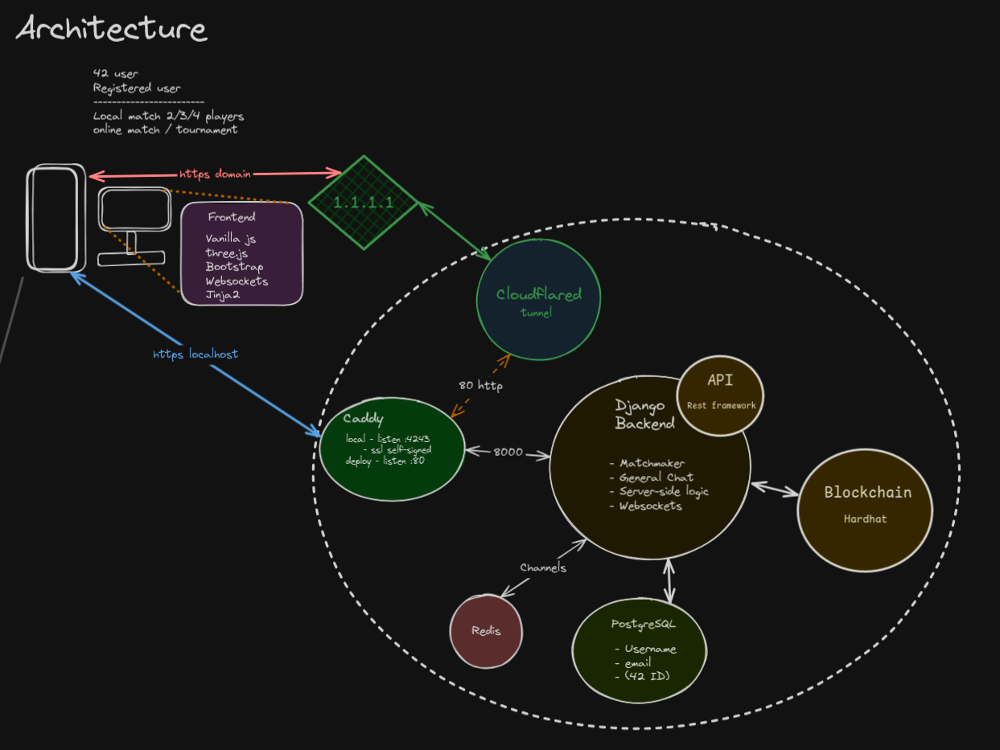

# _ft_transcendence_

[](https://stats.uptimerobot.com/iK804X9tfp)


> This project is about doing something you’ve never done before.
> Remind yourself the beginning of your journey in computer science.
> Look at you now. Time to shine!  
<p style='text-align: center;'> -- en.subject.pdf (v.15) </p>


# _Description_:

Free open-source web platform, mainly for playing Pong games and tournaments.  
Inspired by the classic Pong game of the 70s, infused with modern features and technologies.  

# _Setup_:

  - Everything is launched with a single command line to run
	```bash
	make up
	```
  - Follow the Setup Wizard to configure the project for your instance.  
  Required information:
	- valid Django secret key (generate new one with `make newkey` )
	- valid PostgreSQL information
	- OAuth 42 client id and secret (if you want to use 42 OAuth)
	- Hardhat network URL (if you want to use blockchain features)
	- registered domain name, cloudflare tunnel token and tunnel id (if you want to deploy online)

  - Alteratively, provide own .env file according to the .env.template

  - Explore additional options with 
	```bash
	make help
	```

# _Features_:


> Tip: `make swapmode` to switch between localhost and domain deployment

## _Live Chat_
  - Chat with other online users in real time
  - Send private messages to other users with `/pm <username> <message>`
  - Make mentions with `@<username>` (only works if at the beginning of a message)
  - Use commands with `/<command> <args>`
  - Command `/duel <username>` to challenge another online user to a Pong duel
  - Command `/duel4P <username1> <username2> <username3>` to challenge 3 other online users to a 4 Player Pong match

## _Pong Game_
🏓
### Local
  - Play Pong on a local computer against another player or AI opponent
  - Different variants of Pong available:
	- 2D Pong
	- 3D Pong
	- 4 Player Pong

### Online
  - Play Pong online against other users

### Tournaments
  - Join or create tournaments to compete against other players
  - Setup and play local tournaments on the same computer

## **CLI**

Showing off the beauty of terminals (are sexy), `transcendCLI` makes it possible to login, interact with the live chat and play online games with other players, all without leaving the comfortable blink of the tty cursor.  

For a stunning terminal client, use ft_ascii pong cli, included as submodule:

```bash
git submodule update --init
make -C ft_ascii
make cli
```

Once authenticated, check more options typing `/help`

## _Music:_
  [](https://pixabay.com/de/music/search/arcade/)


# _Points:_

```
1   - Django                            1
0.5 - Bootstrap
0.5 - Postgres                          1
1   - Advanced 3D Techniques            1
1   - Multiple players                  1
1   - remote authentication 42 Oauth    1
0.5 - Additional browser support
0.5 - Support of all devices            1
1   - Standard User managment           1
1   - Remote Players                    1
1   - Live Chat                         1
0.5 - Server-Side Rendering
0.5 - GDPR compliance                   1
1   - Server-Side Pong Game with API    1
1   - AI Opponent                       1
1   - CLI Pong                          1  

      required 7 ,     current total  = 13
```

